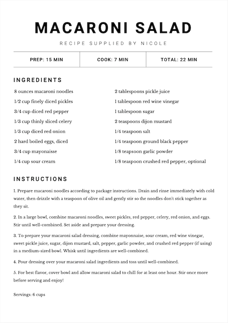

# recipe-pdf-converter

If you have lots of loose, unorganized recipes, then this program is for you! :)
The program will prompt you for recipe specifics, including ingredients, instructions, cook time and servings.
It will then automatically convert and sort all inputted recipes into a nicely formatted PDF document.

Here is an example of a finished recipe:

